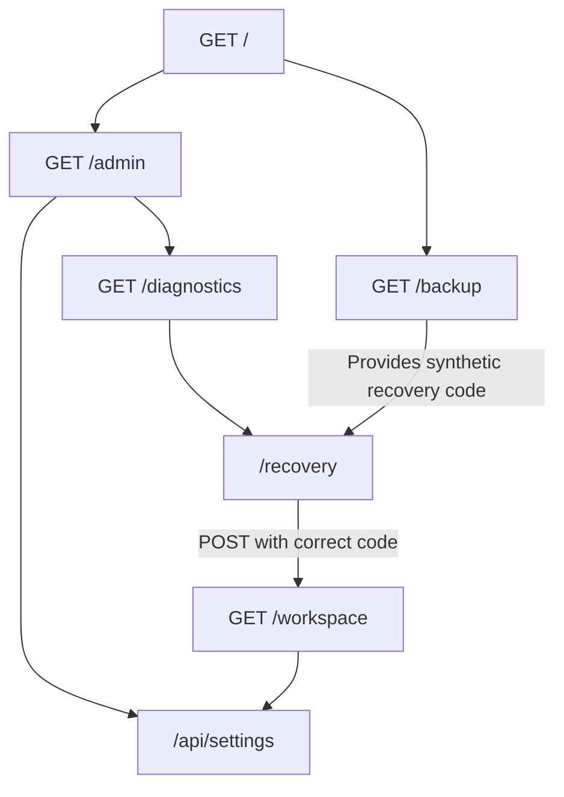

# ARTA-MATRYOSHKA

A research prototype for layered deception and delay

[](https://github.com/daning1212/ARTA-MATRYOSHKA/blob/main/LICENSE)
[](https://github.com/daning1212/ARTA-MATRYOSHKA/blob/main/README.en.md#run-the-lab)
[](https://github.com/daning1212/ARTA-MATRYOSHKA/actions/workflows/test.yml)


[한국어](README.md) | **English**

## Arta Shield 🛡️

**Research prototype · Not for production use. Do not connect real assets.**

> **Firm boundaries. Defense that bends like bamboo.**

The name comes from the idea of connecting simulated rooms and clues in layers, like matryoshka dolls.
The current implementation is finite; the name does not claim infinite nesting or escape prevention.
The CI badge reports functional tests, not verified security effectiveness.

### What we want to build

When attack tools are easy to obtain, defenders should also be able to access and combine practical countermeasures.
ARTA MATRYOSHKA is an **open-source research project exploring layered defense**.

Our vision is a Swiss Army knife for defense: access restrictions, decoy environments, activity records, alerts, and computational tolls that can be selected and combined for different environments.
These capabilities are a research direction, not a claim that every module is implemented or production-ready.

### When a tree breaks, bamboo bends

Strength is not the only way to withstand a storm.
Bamboo bends and lets the force pass, while its roots hold firm.

ARTA follows that principle. Authentication, authorization, and isolation must protect real assets.
On that foundation, we study **redirection, delay, deception, and observation**:
whether isolated decoy paths can encourage exploration, increase verification costs, and lead to simulated outcomes instead of real assets.

The real security boundary must remain intact even when an attacker recognizes or ignores a decoy.
Deception complements that boundary; it does not replace it.

### Evidence, not promises

Our approach is simple: **“We tried this, under these conditions, and observed these results.”**
We publish reproducible code, experimental conditions, raw results, unsuccessful approaches, and unresolved limitations so others can review and improve the work.

| Research component | Current status |
|---|---|
| Decoy worlds, linked clues, and false exits | Local prototype; effectiveness against AI agents untested |
| Request limits and access records | Implemented for the local decoy; operational protection unvalidated |
| Computational toll | Separate HTTP pilot benchmark; reduced repeated-read throughput under tested conditions |
| Strong OS and network isolation | Incomplete |
| External alerts, production integration, and two-person approval | Future work |

The computational-toll pilot observed lower repeated-read throughput after adding puzzle work.
This measures added computation cost; throughput reduction alone does not establish defensive effectiveness.
This was a **localhost benchmark using fixed scripts and two-second runs**, not an AI attack blocking rate or a personal-data protection rate.
[Methods and limitations](docs/TOLLBENCH-REPORT.md) · [Raw results](docs/tollbench-results.json)

In the historical one-thread experiment, total server CPU decreased, but **server CPU per successful record response increased from approximately 0.1147ms to 0.4773ms**. Cost per successful response differs from cost per HTTP request. Lower total load does not establish improved per-record efficiency. The report includes sample standard deviation, minimum/maximum across three repeats, and both cost denominators.

The current release is a **local HTTP research lab**, not a production security product.
It does not guarantee complete protection and must not be connected to real sensitive data.

## Related work and the research question

Computational tolls belong to the established family of client work-cost mechanisms, including [Hashcash — A Denial of Service Counter-Measure (Adam Back, 2002; original-paper PDF mirror)](https://cdn.nakamotoinstitute.org/docs/hashcash.pdf) and [Client Puzzles (Ari Juels and John Brainard, NDSS 1999)](https://www.ndss-symposium.org/ndss1999/cryptographic-defense-against-connection-depletion-attacks/). [Anubis's official design documentation](https://github.com/TecharoHQ/anubis/blob/main/docs/docs/design/why-proof-of-work.mdx) also describes SHA-256 PoW; its [project overview](https://github.com/TecharoHQ/anubis) identifies AI crawler/scraper requests as a target. ARTA uses ordinary hash PoW, not a new cryptographic mechanism or demonstrated improvement over existing tools. Its intended question is **“How do decoy structures and computational tolls respond to AI-agent verification and retry behavior, and what changes in target attainment, exploration, abandonment, and costs on both sides?”** This remains a research question without actual-agent validation, separate from the current fixed-script cost measurements.

## Threat model and success criteria

These are research objectives, not claims that the current app protects real assets.

| Dimension | Scope |
|---|---|
| Adversaries | Automated scripts, AI agents, and people exploring or collecting records within bounded HTTP budgets. Only fixed scripts have been evaluated; AI and human behavior remains untested. |
| Intended real assets | Private business API data, database exports/backups, service configuration, and access credentials. Independent authentication, access control, and isolation must protect those assets. Current experiments use synthetic substitutes and do not connect real assets. |
| Access and behavior | HTTP access to decoys or experimental records. Adversaries may ignore hints, recognize decoys, share bearer proofs, and parallelize CPU work. Solving a puzzle is not trusted-user authentication. |
| Out of scope | DDoS defense, preventing authentication bypass, and preventing OS/network isolation escape. This research neither fixes flaws in those boundaries nor guarantees those defenses. |
| Evidence of help | Repeated reductions in distinct target collection or increases in target collection time against matched time, request, and resource budgets and identical synthetic goals. Decoy evaluation must measure additional exploration/verification behavior together with delayed target attainment. Legitimate-user latency/errors and defender CPU/availability must also be reported and meet predeclared limits. |

Comparators should include a simple rate limit, ordinary PoW, existing honeypots, and disabled features.
Acceptable user impact and minimum effect sizes must be defined before experiments; operational thresholds are not yet established.
Decoy visits, reduced repeated-read throughput, or functional test counts alone are not success criteria.
Access denied by a protected boundary is attributed to that boundary, not credited as a decoy or toll effect.
Published results are preliminary synthetic collection and cost observations, not proof that these research objectives are achieved.

## Run the lab

Python 3.10 or newer. No third-party packages required.

```bash
git clone https://github.com/daning1212/ARTA-MATRYOSHKA.git
cd ARTA-MATRYOSHKA
python -m arta
```

- Decoy: http://127.0.0.1:8080 — JSON API.
- Observer: 127.0.0.1:8081 — bearer authentication required.
- Read events from another terminal: `python -m arta.observe`.
- Check retained-record integrity: `python -m arta.observe --health`.
- Stop: Ctrl+C.

The decoy and collector run in separate processes and bind to localhost.
Do not expose them to the internet or through a reverse proxy.
The observer CLI reads its credential from `data/monitor-token`; do not publish that token.
If you change `--data-dir`, use the same value for the observer CLI.

## The simulated world



This diagram shows baseline links and a simulated state transition.
Before recovery, `/workspace` returns 403, while `/api/settings` remains directly accessible.
These are synthetic routes, not real privilege escalation or OS isolation boundaries.

Entry `/` → administrator `/admin` or archive `/backup` → diagnostics `/diagnostics` or recovery `/recovery` → workspace `/workspace` → settings `/api/settings`.

The workspace initially returns 403. Posting the synthetic recovery code from the archive changes the session's simulated state and permits workspace access.
This is **not a real sandbox escape or privilege escalation**.
Incorrect codes and codes from other sessions are rejected. Settings remain consistent when queried again within the same session.

```bash
curl -c cookies.txt http://127.0.0.1:8080/backup
# Copy recovery_code from the response into PASTE_CODE below.
curl -b cookies.txt -H 'Content-Type: application/json' \
  -d '{"recovery_code":"PASTE_CODE"}' http://127.0.0.1:8080/recovery
curl -b cookies.txt http://127.0.0.1:8080/workspace
curl -b cookies.txt -H 'Content-Type: application/json' \
  -d '{"maintenance":true}' http://127.0.0.1:8080/api/settings
curl -b cookies.txt http://127.0.0.1:8080/api/settings
```

### Expected responses

These JSON responses were checked against the baseline localhost HTTP server.
Session-specific `marker` and `recovery_code` values are replaced with placeholders.
Use the code from **your own `/backup` response**, not the placeholder, in the recovery POST.

`GET /backup` — HTTP 200:

```json
{"revision":"legacy-04","marker":"<SESSION_MARKER>","files":["inventory.json"],"recovery":"/recovery","recovery_code":"<SESSION_RECOVERY_CODE>"}
```

`GET /workspace` before recovery — HTTP 403:

```json
{"error":"recovery required"}
```

`POST /recovery` with the correct code — HTTP 200:

```json
{"recovered":true,"target":"/workspace"}
```

`GET /workspace` after recovery with the same cookie — HTTP 200:

```json
{"environment":"workspace","role":"workspace-admin","settings":"/api/settings","archive":"/backup"}
```

After setting `maintenance` via `POST /api/settings`, querying again within the same session — HTTP 200:

```json
{"saved":true,"settings":{"maintenance":true}}
```

Delete `cookies.txt` after the experiment.
Sessions expire after 15 minutes and have a 100-request world budget.
Restarting resets the simulated world. New sessions can reset the request budget, so it is not a global attack-prevention mechanism.

## Experimental options

```bash
python -m arta --scenario combined --max-runtime 900
python -m arta.experiment
```

Presets: `baseline` (default), `linked`, `many-doors`, `mirror`, `easy`, and `combined`.
Worlds have at most eight doors and three false exits.
False exits open new simulated settings contexts, not connections to other hosts.
Mirrors reflect only allowlisted settings and revision values.
The manifest is a consistent summary/detail baseline, not a validated perceptual-deception mechanism.

The default runtime limit is 900 seconds; `--max-runtime` accepts 1–3600 seconds.
The experiment CLI compares fixed scripts, not AI deception effectiveness.

## Independent computational-toll benchmark

```bash
python -m arta.tollbench --seconds 2 --repeats 3
```

This separate localhost HTTP benchmark compares repeated-read throughput and client/server CPU time with and without a small SHA-256 proof-of-work challenge.
It does not integrate the toll into the main decoy world.

Challenges are resource-bound, expire, and can be redeemed once.
They are bearer proofs, not authenticated user or device identities.
Ordinary hash proof of work can be parallelized.

The default comparison includes 12 two-second runs.
The duration is **per run**: using 300 seconds with three repeats can take approximately one hour in total.
Results are printed as JSON to standard output.

## Records and limits

- Per IP: 30 requests per 60 seconds.
- Request body: 4 KiB; path: 2 KiB; sessions and client entries: 1,000 each.
- Records include known room names, IP, collection time, response status, session hash, world transitions, and step counts.
- Bodies, query strings, authentication headers, raw cookies, and recovery codes are excluded.
- Authenticated JSON UDP telemetry: at most 2 KiB per message, without object deserialization.
- Collector retains the latest 10,000 events; the observer returns the latest 100.
- Collector reports rejection, throttling, acceptance, and storage-error counters.
- SQLite database page budget: 16 MiB, excluding journal files and other disk use.

UDP delivery is best-effort. Collector failure, buffer overflow, and process termination can lose events.
Sender-side error counters cannot detect every loss.

## Security limitations

**Separate processes are not strong isolation.** The default lab runs under the same OS account.
A compromised decoy process could access files, records, tokens, and network resources available to that account.
Separate telemetry and observer credentials provide protocol-level separation, not protection against an OS-level compromise.

Hash chaining can detect some retained-record changes; it cannot prevent or prove complete rewriting or deletion.
A compromised decoy can forge validly structured telemetry.
Sequential HTTP processing and UDP collection are not sufficient protection against flooding or slow connections.
The database page budget is not a total disk-space limit.

Production login protection, distributed-attack defenses, Wi-Fi security, DDoS protection, two-person approval, VDFs, external alerts, and a graphical dashboard are not implemented.
Use only synthetic data in owned or explicitly authorized lab environments.
Strong isolation must be independently established and validated before running untrusted attack tools.


## Distinct synthetic record collection

```bash
python -m arta.collectionbench --seconds 5 --repeats 5 --workers 1 2 4 --resources 100000
```

Each client runs in an independent Python process and fetches distinct synthetic records once.
A common deadline starts after all clients report readiness. The current command budgets 45 runs × 5 seconds
plus process startup and shutdown. The larger dataset avoids baseline exhaustion. Output includes
unique collection, CPU seconds, errors, and sample spread across direct (one round trip), no-work (two round trips), and 14-bit PoW (two round trips). The no-work client does no hash search; the server still hashes once during token validation. The synchronous server and clients share
the same host; this is not an AI, GPU, distributed-attack, or OS-isolation test.
See the [historical two-arm report](docs/COLLECTIONBENCH-REPORT.md), [three-arm control report](docs/CONTROLBENCH-REPORT.md), and [new raw results](docs/collectionbench-control-results.json).

With one client process and matched two-round-trip exchanges, the mean of per-repeat distinct-collection reductions was approximately 95.4% for 14-bit PoW versus the no-work control. This observes incremental solver cost, not security effectiveness. The two-process condition had substantial variation, and errors occurred. These results do not retroactively decompose the earlier “98%” figure.

### What 14-bit difficulty means

Approximating distinct nonce hashes as independent uniform outputs gives success probability 2^-14 and **2^14 = 16,384 attempts on average**, including the successful hash. This is not a fixed attempt count or time guarantee. It is a small workload, not evidence of a meaningful barrier for optimized native code or GPUs. GPU costs were not measured, so we do not assert a numerical “free” cost. Interpret the measurements as **this fixed Python client slowing down with additional solver work**. A future difficulty sweep should keep matched round trips and time/resource budgets and report collection and costs on both sides; no such curve has been measured yet. The distinct-collection CLI, `arta.collectionbench --bits`, currently supports 1..18 bits.

## Simple rate limit and error remeasurement

```bash
python -m arta.collectionbench --seconds 5 --repeats 5 --workers 1 2 4 --resources 100000 --include-rate-limit
```

The existing `Lab.allowed` policy (30 requests per IP per 60 seconds) is reused in the same collection harness for a four-condition comparison.
This command budgets 60 runs × 5 seconds plus process preparation/shutdown. Clients honor Retry-After on 429 responses; this is not a flooding or DDoS availability test.
Error kinds, stages, and remaining time separate policy rejections from transport and deadline errors.
See [direct validation report](docs/RATELIMIT-REPORT.md), [main raw results](docs/ratelimit-results.json), and [one-second-window raw results](docs/ratelimit-window1-results.json).

Across 72 remeasurement runs, all 24 non-policy errors in the main comparison were timeouts observed after the time budget ended. In five-second single-IP comparisons, rate limiting admitted 30 records at the default policy and 150 at 30 requests/second. Corresponding one-process PoW means were 286.6 and 255.0 records. This does not support PoW superiority under these settings. Legitimate-user allowances and impact were not matched, so no general ranking is established.

## Unverified claims and why

**Unverified** means the current implementation and measurements do not establish a claim.
It does not mean the approach has been disproved or can never be evaluated.
Passing functional tests is distinct from validating security effectiveness.

| Unverified claim | Why it remains unverified | Evidence needed |
|---|---|---|
| AI-agent exploration, deception, and abandonment | Executed evaluations use fixed scripts. There are no repeated actual-agent comparisons, and the isolation boundary for untrusted tools has not been validated. | Validated isolation; repeated decoy/no-decoy comparisons across models and strategies; paths, verification behavior, collection, and abandonment measurements |
| Strong OS and network isolation | The default app uses separate processes under one OS account. App-enforced host-file, token, and outbound-network restrictions are not implemented and validated. Earlier network-namespace creation failed due to permissions, and Docker was unavailable for that evaluation. | Separate privileges, restricted file access, network policies, and tests demonstrating denied file and network operations |
| Toll resistance to GPU or distributed computation | Measurements use 1, 2, or 4 CPU client processes on one host. There are no GPU or multi-host results; ordinary hash PoW is parallelizable. | Optimized CPU/GPU and multi-host comparisons with matched time and cost budgets |
| Sustained performance and cross-environment reproducibility | The new measurements are five repetitions of five seconds per condition. Functional tests overlapped some intervals in the historical two-arm experiment, but not the new three-arm experiment. Dedicated resources, sustained load, and other machines were not evaluated. | Longer controlled repeats and published hardware, resource allocation, and load conditions |
| Scope of computation/round-trip cost separation | The baseline uses one HTTP request and the toll uses two. Round trips, Python loops, and server processing are confounded; the earlier two-arm experiment lacked a matched control. A separate three-arm experiment now compares protocol overhead with incremental PoW cost; it cannot retroactively decompose the earlier percentage or measure optimized pure hashing cost. | Further controlled repeats and optimized solver/server cost measurements |
| Operational availability, legitimate-user impact, and real-data protection | This is a localhost synthetic-data pilot; the toll is not integrated with the main app or a production service. Real authentication and protected-asset boundaries, slow connections, flooding, and legitimate-user flows were not evaluated. | Isolated comparisons with synthetic protected assets, legitimate-request latency/errors, availability under load, and bypass-path tests |
| No session binding for puzzles (tokens can be transferred/shared) | Known implementation limitation: proofs bind resource ID, expiry, and single use, but not a user, session, or device. Another client holding a token can use it. | A session-binding policy and cross-session rejection, legitimate-use, and replay tests |
| Scope of existing-approach comparisons | Simple rate limiting and ordinary hash PoW were compared with the same synthetic records and time budget. Legitimate-user allowances and impact were not matched; the complete decoy approach and existing operational honeypots remain untested. General superiority is not established. | Comparisons matching legitimate-user allowances/impact and bypass paths, plus decoy/honeypot evaluations |
| Complete, trustworthy records after compromise | UDP does not guarantee delivery; hash chains cannot prevent complete rewriting or deletion. Record safety after compromise of the shared OS account has not been validated. | Privilege-separated collection/storage and loss, forgery, deletion, and tampering tests |

Writing isolation designs, matched controls, and longer-run experiment code is feasible.
A design or implementation alone does not validate these claims.
Additional equipment, permissions, and executed evaluations are needed before changing their status.

## An invitation to reproduce and extend the research

This project publishes ideas and preliminary experiments for defense against AI-assisted attacks.
The current computational-toll results come from fixed scripts, not actual AI-agent experiments.

The creator's hardware and execution environment limit the experiments we can perform.
The reports describe what we tested and what remains unverified.
If you have suitable equipment and a safely isolated environment, please reproduce the code and extend the experiments.

### First contributions

These tasks have the `good first issue` label. Each issue specifies scope, reproduction steps, and completion criteria.

- [Reproduce short-run results with one CPU process and 30-second runs (#3)](https://github.com/daning1212/ARTA-MATRYOSHKA/issues/3)
- [Validate experiment JSON summaries, errors, and dataset exhaustion (#4)](https://github.com/daning1212/ARTA-MATRYOSHKA/issues/4)
- [Write a minimal comparison plan for existing defense approaches (#5)](https://github.com/daning1212/ARTA-MATRYOSHKA/issues/5)

We welcome longer runs and repeated measurements; multi-process, GPU, or distributed solvers; collection of distinct synthetic records; actual AI-agent verification, bypass, abandonment, and decoy-detection behavior; and measurements of defender cost and legitimate-user impact.

Use owned or explicitly authorized isolated environments and synthetic data.
We are not requesting tests against real services or personal information.
Share the code revision, hardware and environment, conditions, reproduction commands, raw results, and limitations through an Issue or Pull Request.
Negative results and failed reproductions are welcome.

**Our goal is to build evidence that others can verify, not to declare perfect protection.**

## Tests and research records

```bash
python -m unittest discover -s tests -v
```

The computational-toll development stage passed 22 local functional tests.
This is **not evidence of blocking 22 attack types**.

The following research reports are currently in Korean:

- [Design and AI evaluation plan](docs/DESIGN.md)
- [Second-stage report and self-review](docs/REPORT.md)
- [Additional idea review and scenario results](docs/IDEA-REVIEW.md)
- [Computational-toll pilot report](docs/TOLLBENCH-REPORT.md)

**Co-developed by:** Healing Arty & Arta.

MIT License. Contributions, reproducibility checks, and constructive criticism are welcome.
