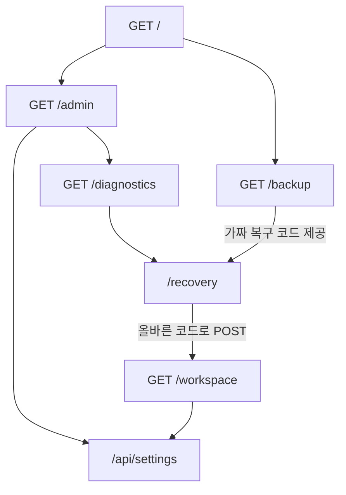

# ARTA-MATRYOSHKA

다층 기만·지연 연구 프로토타입

[](https://github.com/daning1212/ARTA-MATRYOSHKA/blob/main/LICENSE)
[](https://github.com/daning1212/ARTA-MATRYOSHKA#실행)
[](https://github.com/daning1212/ARTA-MATRYOSHKA/actions/workflows/test.yml)


**한국어** | [English](README.en.md)

## 아르타 쉴드 🛡️

**연구 프로토타입 · 운영 사용 불가. 실제 자산과 연결하지 마세요.**

> **단단한 경계 위에, 대나무처럼 유연한 방어를.**

마트료시카 인형처럼 가짜 방과 단서를 겹겹이 이어가는 구상에서 이름을 붙였습니다.
현재 구현은 유한한 가짜 세계이며, 끝없는 중첩이나 탈출 방지를 구현했다는 뜻은 아닙니다.
CI 배지는 기능 테스트 상태를 보여 주며 보안 효과 검증 배지가 아닙니다.

### 우리가 만들고 싶은 것

공격 도구를 쉽게 구할 수 있는 시대라면, 방어하는 사람도 여러 대응 수단을 쉽게 꺼내 쓸 수 있어야 합니다.
ARTA MATRYOSHKA는 그 생각에서 출발한 **오픈소스 다층 방어 연구 프로젝트**입니다.

우리가 지향하는 모습은 맥가이버칼 같은 방어 도구입니다.
접근 제한, 미끼 공간, 행동 기록, 알림, 계산 통행료를 환경에 맞게 선택하고 조합하는 것.
하나의 기능에 모든 것을 맡기기보다, 서로 다른 역할을 하는 방어 수단이 함께 작동하도록 연구합니다.

### 나무가 부러질 때, 대나무는 휘어집니다

강한 바람을 버티는 방법은 단단함만이 아닙니다.
대나무는 휘어지며 힘을 흘려보내지만, 땅을 붙잡은 뿌리까지 내주지는 않습니다.

ARTA도 같은 방향을 지향합니다.
실제 자산의 인증·접근통제·격리를 기반으로, 공격을 막는 방어에 **유도·지연·기만·관측**을 더합니다.
격리된 미끼 경로를 탐색하게 하고, 진위를 확인하는 데 비용을 쓰게 하며,
실제 자산 대신 가짜 결과에 도달하게 할 수 있는지 시험합니다.

공격자가 미끼를 알아채거나 안내를 무시해도 실제 자산의 경계는 유지되어야 합니다.
유연함은 그 경계를 보완하는 전략이며, 격리와 접근통제를 대신하는 약속이 아닙니다.

### 아이디어를 주장으로 끝내지 않기

ARTA는 **“이렇게 해보았더니, 이 조건에서 이런 결과가 나왔다”**를 남깁니다.
재현 가능한 코드, 실험 조건, 원본 결과, 효과가 없었던 시도와 남은 한계를 함께 공개합니다.
다른 사람이 검토하고 개선할 수 있는 연구 기록을 만드는 것이 현재의 목표입니다.

| 연구 수단 | 현재 상태 |
|---|---|
| 미끼 세계·연결된 단서·가짜 출구 | 로컬 시제품 구현, 실제 AI 기만 효과 미검증 |
| 요청 제한·접근 기록 | 로컬 미끼에 구현, 운영 방어 효과 미검증 |
| 계산 통행료 | 별도 HTTP 예비 실험 구현, 특정 조건에서 반복 조회 처리량 감소 관측 |
| 강력한 OS·네트워크 격리 | 미완료 |
| 외부 알림·운영 연동·두 사람 승인 | 향후 검토 |

계산 통행료 예비 실험에서는 퍼즐을 추가했을 때 반복 조회 처리량이 줄었습니다.
이는 **2초 단위의 localhost 고정 스크립트 실험**에서 추가 계산 비용을 확인한 결과입니다.
처리량 감소만으로 방어 효과를 입증할 수 없으며, AI 공격 차단률이나 개인정보 유출 방지율이 아닙니다.
[실험 조건과 한계](docs/TOLLBENCH-REPORT.md) · [원본 결과](docs/tollbench-results.json)

현재 배포물은 **연구용 로컬 HTTP 실험실**입니다.
완벽한 방어 또는 운영 환경의 안전을 보장하지 않으며, 실제 자료와 연결하는 단계가 아닙니다.

## 위협 모델과 성공 기준

아래는 연구가 상정하는 목표입니다. 현재 앱이 실제 자산을 보호한다는 설명이 아닙니다.

| 구분 | 범위 |
|---|---|
| 대상 공격자 | 제한된 HTTP 요청 예산으로 자료를 탐색·수집하는 자동화 스크립트, AI 에이전트, 사람. 실제 측정은 고정 스크립트만 수행했으며 AI·사람 행동은 미검증입니다. |
| 상정하는 실제 자산 | 업무 API의 비공개 데이터, 데이터베이스 내보내기·백업, 서비스 설정·접근 자격정보. 별도 인증·접근통제·격리 경계가 이 자산을 보호한다는 전제입니다. 현재 실험에는 합성 대체물만 사용하고 실제 자산을 연결하지 않습니다. |
| 공격자의 접근·행동 | HTTP를 통해 미끼나 실험용 자료에 접근합니다. 안내를 무시하거나 미끼를 알아채고, 토큰을 공유하거나 CPU로 병렬 계산할 수 있다고 가정합니다. 퍼즐을 푼 사실을 신뢰할 수 있는 사용자 인증으로 취급하지 않습니다. |
| 범위 밖 | DDoS 방어, 인증 우회 차단, OS·네트워크 격리 탈출 차단. 이 연구는 기존 경계의 취약점을 해결하거나 해당 방어를 보장하지 않습니다. |
| 도움의 성공 기준 | 같은 시간·요청·자원 예산과 같은 합성 목표에서 비교군보다 고유 목표 수집량 감소 또는 목표 수집 시간 증가가 반복 관측되어야 합니다. 미끼에 대한 효과는 추가 탐색·검증 행동과 실제 목표 도달 지연을 함께 측정해야 합니다. 정상 사용자 지연·오류와 방어 측 CPU·가용성을 함께 공개하고, 사전 설정한 허용 범위를 만족해야 합니다. |

비교군은 단순 rate limit, 일반 PoW, 기존 허니팟과 기능을 끈 조건으로 설계해야 합니다.
허용 가능한 사용자 부담과 최소 효과 크기는 실험 전에 정해야 하며, 현재는 운영 판단용 수치를 확정하지 않았습니다.
미끼 방문·반복 조회량 감소·기능 테스트 통과만으로 성공을 선언하지 않습니다.
보호 경계에서 거부된 접근은 경계의 결과로 기록하며 미끼나 계산 통행료의 성과로 더하지 않습니다.
현재 공개 결과는 특정 구현의 합성 자료 수집·계산 비용 예비 관측이며 위 연구 목표의 달성 증거가 아닙니다.

## 실행

Python 3.10 이상. 추가 패키지 불필요.

```bash
git clone https://github.com/daning1212/ARTA-MATRYOSHKA.git
cd ARTA-MATRYOSHKA
python -m arta
```

- 미끼: http://127.0.0.1:8080 (JSON API)
- 관측: 127.0.0.1:8081 (Bearer 인증 필수)
- 기록 조회: 다른 터미널에서 `python -m arta.observe`
- 기록 검사: `python -m arta.observe --health`
- 종료: Ctrl+C

미끼와 수집기는 별도 프로세스로 실행됩니다. 양쪽 모두 localhost에만 바인딩됩니다.
인터넷이나 리버스 프록시로 공개하지 마세요. 관측 토큰은 `data/monitor-token`에 저장되며
관측 CLI가 읽습니다. 토큰을 URL, 스크린샷, GitHub에 올리지 마세요.
`--data-dir`을 바꿨다면 관측 CLI에도 동일한 값을 전달하세요.

## 가짜 세계



기본 프리셋의 링크 안내와 가짜 상태 전이를 보여 주는 흐름도입니다.
복구 전 `/workspace`는 403을 반환하지만 `/api/settings`는 직접 조회할 수 있습니다.
모든 경로는 합성 상태이며, 실제 서버 권한 상승이나 OS 격리 경계를 나타내지 않습니다.

입구 `/` → 관리자 `/admin` 또는 백업 `/backup` → 진단 `/diagnostics` 또는 복구 `/recovery`
→ 작업 공간 `/workspace` → 설정 `/api/settings`.

작업 공간은 처음에 403을 반환합니다. 백업의 **가짜 복구 코드**를 `/recovery`에 POST하면
가짜 상태가 `sandbox`에서 `workspace`로 바뀌며 작업 공간 접근이 허용됩니다.
이것은 실제 샌드박스 탈출이나 실제 권한 상승이 아닙니다.
잘못된 코드는 항상 거부되며 다른 세션의 코드도 사용할 수 없습니다.
설정 변경은 같은 세션에서 재조회해도 유지됩니다.

```bash
curl -c cookies.txt http://127.0.0.1:8080/backup
# 위 JSON의 recovery_code를 아래 값으로 사용하세요.
curl -b cookies.txt -H 'Content-Type: application/json' \
  -d '{"recovery_code":"PASTE_CODE"}' http://127.0.0.1:8080/recovery
curl -b cookies.txt http://127.0.0.1:8080/workspace
curl -b cookies.txt -H 'Content-Type: application/json' \
  -d '{"maintenance":true}' http://127.0.0.1:8080/api/settings
curl -b cookies.txt http://127.0.0.1:8080/api/settings
```

### 예상 응답

기본 프리셋을 localhost에서 실제 실행해 확인한 JSON입니다.
`marker`와 `recovery_code`는 세션마다 달라서 아래에서는 자리표시자로 바꿨습니다.
POST에는 자리표시자가 아니라 **자신의 `/backup` 응답에서 받은 코드**를 사용하세요.

`GET /backup` — HTTP 200:

```json
{"revision":"legacy-04","marker":"<SESSION_MARKER>","files":["inventory.json"],"recovery":"/recovery","recovery_code":"<SESSION_RECOVERY_CODE>"}
```

복구 전 `GET /workspace` — HTTP 403:

```json
{"error":"recovery required"}
```

올바른 코드를 보낸 `POST /recovery` — HTTP 200:

```json
{"recovered":true,"target":"/workspace"}
```

같은 쿠키로 복구 후 `GET /workspace` — HTTP 200:

```json
{"environment":"workspace","role":"workspace-admin","settings":"/api/settings","archive":"/backup"}
```

`POST /api/settings`로 `maintenance`를 변경한 뒤 같은 세션에서 재조회 — HTTP 200:

```json
{"saved":true,"settings":{"maintenance":true}}
```

실험 후 `cookies.txt`를 삭제하세요. 세션은 15분 또는 세계 요청 100회로 제한됩니다.
재시작하면 가짜 세계는 초기화됩니다. 새 세션으로 예산을 초기화할 수 있으므로
이 예산은 전역 공격 차단 장치가 아닙니다.

## 추가 실험 옵션

```bash
python -m arta --scenario combined --max-runtime 900
python -m arta.experiment
```

`baseline`(기본), `linked`, `many-doors`, `mirror`, `easy`, `combined` 프리셋을 지원합니다.
문 수 최대 8, 가짜 출구 최대 3입니다. 출구는 새 가짜 설정 상태를 열며 실제 다른 호스트로
접속하지 않습니다. 거울은 허용된 가짜 설정과 revision만 반영합니다.
manifest는 요약/세부의 일관성을 확인하는 기준선이며 정교한 착시 구현이 아닙니다.
기본 실행은 900초 후 종료됩니다. `--max-runtime`은 1..3600초입니다.
실험 CLI는 고정 스크립트 기능 비교입니다. AI 기만 효과를 측정하지 않습니다.

## 기록과 상한

- IP당 60초에 30회 요청, 본문 4 KiB, 경로 2 KiB, 세션·클라이언트 각각 1,000개.
- 알려진 방 이름, IP, 수집 시간, 응답 상태, 세션 해시, 세계 전이, 단계 수 기록.
- 본문·쿼리·인증 헤더·원본 쿠키·복구 코드 기록 제외.
- 별도 수집기로 인증된 최대 2 KiB JSON UDP 메시지 전달. 객체 역직렬화 없음.
- 수집기가 보관하는 최근 10,000개 이벤트 중 최근 100개를 관측 API로 조회.
- 인증 실패·형식 오류·저장 오류 관련 수집기 카운터 제공.

UDP 전송은 최선형 전달이며 전달 보장이 아닙니다. 수집기 종료·버퍼 초과·프로세스 종료 때
이벤트가 유실될 수 있습니다. 송신 오류 감지 카운터는 콘솔에 표시하지만 모든 유실을 알 수는 없습니다.

## 보안 한계

**별도 프로세스는 강력한 격리가 아닙니다.** 기본 실행은 같은 OS 계정입니다.
미끼 코드 실행이 장악되면 그 계정이 읽을 수 있는 기록·토큰·호스트 파일도 위험합니다.
기록 전달 전용 토큰과 관측 토큰은 다르지만 파일 권한은 다른 OS 계정만 제한합니다.
미끼의 실제 서버 접근·외부 통신을 OS 수준에서 차단하는 기능은 아직 없습니다.

기록 해시는 일부 변조를 감지할 뿐, 전체 재작성·삭제를 막거나 증명하지 않습니다.
이벤트는 미끼가 보고한 데이터이므로 미끼가 장악되면 위조 가능합니다.
순차 HTTP 처리와 UDP 수집은 폭주·느린 연결 공격에 충분한 방어가 아닙니다.
DB 본체의 페이지 예산은 16 MiB입니다. journal과 전체 디스크 공간의 상한은 아닙니다.

실제 로그인 보호, 분산 공격 대응, 와이파이 보안, DDoS 방어, 두 사람 승인,
VDF, 외부 알림, 시각적 대시보드는 미구현입니다.
계산 통행료는 별도 실험 모듈이며 기존 미끼 세계와 운영 서비스에는 통합되지 않았습니다.
실제 비밀·개인정보를 넣지 말고 허가된 격리 실험 환경에서만 사용하세요.

## 고유 합성 자료 수집 비교

```bash
python -m arta.collectionbench --seconds 5 --repeats 5 --workers 1 2 4 --resources 100000
```

각 클라이언트는 별도 Python 프로세스이며, 서로 다른 합성 자료를 한 번씩 조회합니다.
모든 클라이언트의 준비가 끝난 뒤 공통 시간 예산을 시작합니다.
현재 기본 실행은 45회 × 5초 = 총 225초 예산에 프로세스 준비·종료 시간이 더해집니다.
자료 기본값은 100,000개이며, 이번 측정에서는 자료가 소진되지 않았습니다.
직접 조회(1왕복), 무계산 대조군(2왕복), 14비트 PoW(2왕복)를 비교합니다.
무계산은 클라이언트 해시 탐색이 없다는 뜻이며, 서버는 토큰 검증 시 해시를 한 번 계산합니다.
고유 수집량·CPU초·오류·반복 측정의 편차를 기록합니다.
같은 호스트의 단일 HTTP 서버와 CPU를 공유하며 실제 AI·GPU·분산 공격 실험은 아닙니다.
[기존 2조건 보고서](docs/COLLECTIONBENCH-REPORT.md) · [기존 결과](docs/collectionbench-results.json)
[3조건 대조 실험 보고서](docs/CONTROLBENCH-REPORT.md) · [새 원본 결과](docs/collectionbench-control-results.json)

1프로세스의 동일 2왕복 비교에서 무계산 대조군 대비 14비트 PoW의 고유 수집량은
반복별 감소율 평균 약 95.4% 줄었습니다. 이는 추가 솔버 작업의 비용 관측이며 방어 효과의 증거가 아닙니다.
2프로세스 조건은 편차가 컸고 오류도 발생했습니다. 과거 “98% 감소”의 원인을 소급 분해하지 않습니다.

## 미검증 항목과 이유

여기서 **미검증**은 효과가 없다는 결론도, 앞으로 검증할 수 없다는 뜻도 아닙니다.
현재 확보한 구현·실험·측정 결과로 해당 주장을 입증하지 못했다는 뜻입니다.
기능 테스트 통과와 실제 보안 효과 검증은 구분합니다.

| 미검증 항목 | 아직 검증하지 못한 이유 | 검증에 필요한 것 |
|---|---|---|
| 실제 AI의 미끼 탐색·기만·포기 효과 | 지금까지 직접 실행한 것은 고정 스크립트입니다. 실제 AI의 행동과 비교군을 반복 측정한 기록이 없고, 신뢰할 수 없는 도구를 실행할 격리 경계도 검증되지 않았습니다. | 검증된 격리 환경에서 미끼 유무·모델·전략별 반복 실험과 탐색 경로·검증 행동·수집량·포기율 계측 |
| 강력한 OS·네트워크 격리 | 기본 앱은 같은 OS 계정의 별도 프로세스입니다. 호스트 파일·토큰 접근과 외부 통신을 막는 OS 정책이 앱에 구현·검증되지 않았습니다. 기존 실험에서 network namespace 생성은 권한 문제로 실패했고 Docker도 없어 해당 경로를 검증하지 못했습니다. | 권한 분리·파일 접근 제한·네트워크 정책 구성 후 금지된 파일 접근과 외부 통신이 실제로 차단되는지 시험 |
| GPU·분산 계산에 대한 통행료 저항성 | 실행한 비교는 같은 호스트의 CPU 프로세스 1·2·4개뿐입니다. GPU 또는 여러 호스트의 실행 결과가 없으며, 일반 해시 PoW는 병렬화 가능합니다. | GPU·여러 호스트·최적화된 구현을 사용한 동일 시간·비용 예산 비교 |
| 장기 성능·서로 다른 환경에서의 재현성 | 각 측정은 조건별 5초 × 5회입니다. 과거 2조건 실험에는 기능 테스트가 일부 병행되었지만 새 3조건 실험에는 병행하지 않았습니다. 전용 자원·장기 지속 부하·다른 장비에서 재현하지 않았습니다. | 통제된 환경의 장기 반복 측정과 장비·자원 할당·부하 조건 공개 |
| 계산·왕복 비용 분해의 범위 | 기준선은 HTTP 요청 1개, 통행료는 2개여서 왕복·Python 루프·서버 처리 비용이 섞입니다. 이전 2조건 실험에는 무계산 대조군이 없었습니다. 별도 3조건 대조 실험으로 왕복·프로토콜 비용과 PoW 추가 비용을 비교합니다. 결과는 이전 실험의 감소율을 소급 분해하지 않으며 최적화된 순수 해시 비용과도 구분합니다. | 통제된 환경의 추가 반복과 최적화된 솔버·서버 비용 분리 측정 |
| 운영 가용성·정상 사용자 부담·실제 자료 보호 | 합성 자료를 쓰는 localhost 예비 실험이며 통행료는 본 앱·운영 서비스와 미통합입니다. 실제 인증·보호 자산 경계, 느린 연결·폭주, 정상 사용자 흐름을 검증하지 않았습니다. | 합성 보호 자산을 둔 격리된 서비스 비교와 정상 요청 지연·오류·공격 중 가용성·우회 경로 시험 |
| 퍼즐의 세션 바인딩 없음(토큰 전달·공유 가능) | 알려진 구현 한계입니다. 퍼즐은 자료 ID·만료·일회성에 연결되지만 사용자·세션·기기에 연결되지 않습니다. 토큰을 가진 다른 클라이언트가 사용할 수 있습니다. | 세션 바인딩 정책 구현 후 다른 세션의 토큰 사용 거부·정상 사용·재사용 시험 |
| 기존 방식과의 비교 없음 | 전체 기법을 단순 rate limit·일반 PoW·기존 허니팟과 동일 조건에서 비교하지 않았습니다. 이번 통행료 모듈 자체는 일반 해시 PoW이며, 무계산 대조군은 기존 방식보다 우수하다는 증거가 아닙니다. | 동일 목표·예산의 비교군과 정상 사용자·방어 측 비용 계측 |
| 기록의 완전성·침해 후 신뢰성 | UDP는 전달 보장이 없고 기록 해시는 전체 재작성·삭제를 막지 못합니다. 같은 계정이 장악된 뒤에도 기록이 안전하다는 검증은 없습니다. | 권한이 분리된 수집·보관 경계와 이벤트 유실·위조·삭제·변조 시험 |

격리 설계·대조군 구현·장기 실험 코드를 작성하는 일은 가능합니다.
그러나 설계나 코드가 있다는 이유만으로 위 항목을 검증 완료로 표시하지 않습니다.
장비·권한·실험 범위의 한계를 보완한 뒤 실제 실행 결과를 추가해야 합니다.

## 함께 실험할 분을 기다립니다

이 프로젝트는 AI를 활용한 공격에 대응하는 방어 연구의 아이디어와 예비 실험을 공개한 기록입니다.
현재의 계산 통행료 결과는 고정 스크립트 실험이며, 실제 AI 에이전트에 대한 효과는 아직 검증하지 못했습니다.

제작자의 장비와 실행 환경에 한계가 있어, 현재 보고서에 명시한 범위까지만 실험했습니다.
더 적합한 장비와 안전하게 격리된 환경을 갖춘 분이라면, 공개한 코드를 재현하고 실험을 확장해 주세요.

### 처음 기여한다면

아래 작업은 `good first issue` 라벨로 열려 있습니다. 각 Issue에 범위·실행 방법·완료 기준을 적었습니다.

- [CPU 1프로세스·30초 반복 측정으로 단기 결과 재현 (#3)](https://github.com/daning1212/ARTA-MATRYOSHKA/issues/3)
- [실험 JSON의 요약·오류·자료 소진 검사 도구 (#4)](https://github.com/daning1212/ARTA-MATRYOSHKA/issues/4)
- [기존 방어 방식 비교 실험의 최소 계획 작성 (#5)](https://github.com/daning1212/ARTA-MATRYOSHKA/issues/5)

특히 다음 검증을 환영합니다.

- 더 긴 실행과 반복 측정에서 결과가 유지되는지.
- 여러 프로세스·GPU·분산 계산으로 통행료를 얼마나 줄일 수 있는지.
- 서로 다른 합성 자료의 수집량이 어떻게 달라지는지.
- 실제 AI 에이전트가 미끼를 검증·무시·우회하거나 포기하는지.
- 공격 측 비용과 방어 측 비용, 정상 사용자에게 생기는 부담이 어느 정도인지.

실험은 소유하거나 명시적으로 허가받은 격리 환경과 합성 자료로 진행해 주세요.
실제 서비스나 개인정보를 대상으로 하는 실험을 요청하지 않습니다.
Issue 또는 Pull Request에 코드 버전, 장비·환경, 조건, 실행 방법, 원본 결과와 한계를 공유해 주세요.
기대와 다른 결과, 효과가 없었던 경우, 재현 실패도 환영합니다.

**우리의 목표는 완벽한 방어를 선언하는 것이 아니라, 함께 검증할 수 있는 근거를 쌓는 것입니다.**

## 테스트와 문서

```bash
python -m unittest discover -s tests -v
```

- [설계와 AI 실험 계획](docs/DESIGN.md)
- [2단계 개발 보고서와 자체 문답](docs/REPORT.md)
- [추가 아이디어 검토·테스트 결과](docs/IDEA-REVIEW.md)
- [계산 통행료 예비 실험 보고서](docs/TOLLBENCH-REPORT.md)

**공동개발:** Healing Arty & Arta.

MIT License. 개선 제안과 기여를 환영합니다.
