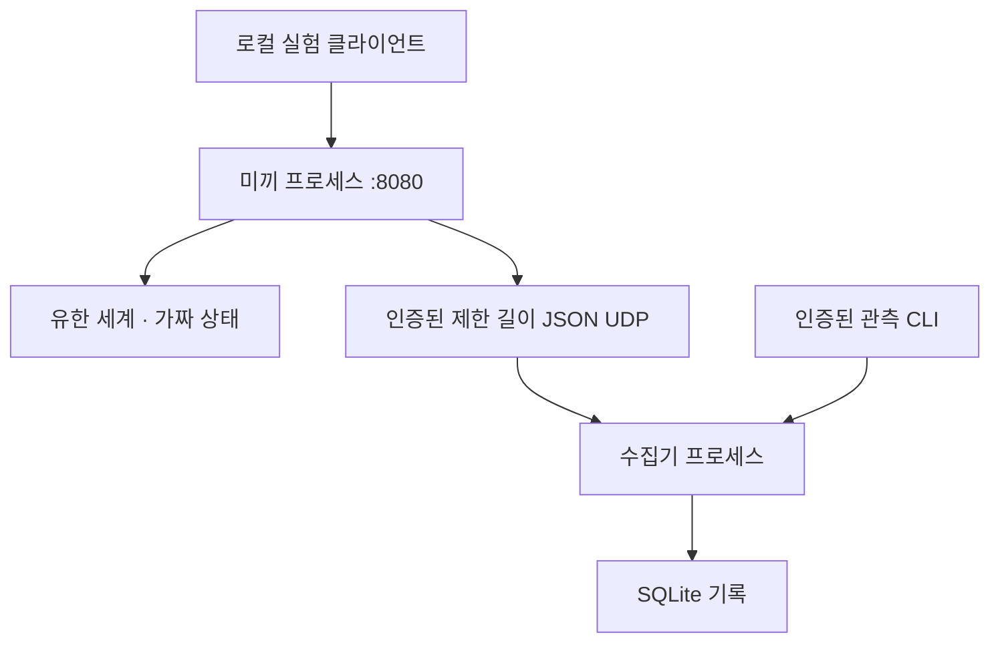

# Healing Arty & Arta 공동개발 — 개발 보고서

작성: 2026-10-07. 로컬 시제품 두 번째 개발 단계.

## 결과

일관된 유한 미끼 세계, 가짜 복구 상태 전이, 별도 기록 수집 프로세스,
인증된 관측 API와 CLI를 구현했다. 실제 보안 격리와 AI 효과 검증은 미완료다.

## 모듈

| 파일 | 역할 |
|---|---|
| arta/__main__.py | 자식 프로세스 감독·시작·종료·로컬 토큰 생성 |
| arta/world.py | 유한 세계·권한 거부·복구·설정 상태 |
| arta/web.py | 미끼 HTTP·요청 제한·세션·기록 이벤트 |
| arta/telemetry.py | 제한된 JSON UDP 기록 전달 |
| arta/collector.py | 기록 입력 인증·스키마 검사·관측 인증 |
| arta/audit.py | SQLite 보관과 해시 연결 검사 |
| arta/observe.py | 인증 토큰을 파일에서 읽는 관측 CLI |

## 자체 질문과 답

**Q: 같은 정보를 다시 확인하면 결과가 바뀌는가?**
A: 상태가 그대로면 권한과 설정 결과도 같다. 복구 POST가 성공할 때만 세계 상태가 바뀐다.

**Q: 작업 공간 URL을 바로 알아내면 복구를 우회하는가?**
A: 현재 세션이 sandbox 상태라면 403이다. URL 은닉 대신 상태 검사로 제한한다.
이것은 미끼 규칙 검증이며 실제 시스템 인증이 아니다.

**Q: 복구 코드를 다른 세션에 쓰거나 틀리게 보내면?**
A: 거부된다. 같은 세션에서 반복 복구는 같은 상태를 유지하며 추가 전이를 만들지 않는다.

**Q: 깊이를 모르게 만들면 우리도 위치를 잃는가?**
A: 알려진 방, 이전·이후 세계 상태, 단계 수, 전이를 기록한다. 최근 기록 100개만 표시하므로
전체 장기 재생 화면은 아직 없다.

**Q: 별도 프로세스이면 장악돼도 안전한가?**
A: 아니다. 같은 OS 계정은 기록 파일과 토큰에 접근할 수 있다. 강력한 격리는 다음 과제다.

**Q: 기록 전달 자체가 침해 경로가 될 수 있는가?**
A: 첫 구현 후보인 프로세스 큐는 pickle 역직렬화 경계를 만들었다. 자체 검토에서 제거하고
인증된 제한 길이 JSON 데이터그램과 스키마 검사로 바꿨다. 코드 실행 객체를 입력으로 복원하지 않는다.

**Q: 기록이 반드시 남는가?**
A: 아니다. 성공적으로 수집·저장한 기록은 연결 종료 뒤 남지만 UDP 유실과 종료 직전 유실이 가능하다.
저장 오류는 카운터로 확인한다. 원격 영속 수집·확인 응답·유실 감지 보완이 필요하다.

**Q: 공격자가 이벤트를 위조하면?**
A: 미끼가 장악되면 기록 토큰으로 정상 형식의 거짓 이벤트를 보낼 수 있다.
스키마 검사는 형식만 검증한다. 독립 네트워크 관측 등 별도 증거원이 필요하다.

**Q: 미끼가 장악돼도 관리자 관측 토큰은 안전한가?**
A: 미끼 프로세스 인자로는 주지 않지만 같은 OS 계정이 토큰 파일을 읽을 수 있다.
토큰 분리는 프로토콜상 권한 분리이며 OS 침해 방어가 아니다.

**Q: 요청 폭주와 느린 연결을 견디는가?**
A: 제한과 2초 소켓 대기 제한을 두었지만 순차 서버이므로 충분하지 않다.
소켓 제한은 전체 요청 시간 상한도 아니다. UDP 폭주와 디스크 부하도 추가 시험이 필요하다.

**Q: AI가 더 똑똑하면 더 오래 갇히는가?**
A: 미검증이다. 일관된 결과를 더 확인할 수도 있지만 미끼를 빨리 알아채거나 무시할 수도 있다.

**Q: 현재 지연 시간은 얼마인가?**
A: 측정하지 않았다. 강제 연산과 지연 응답은 없다. 요청 제한과 탐색 단계만 존재한다.

## 검증

로컬 unittest 11개 통과. 다음 항목을 검증했다.

- 설정 변경 유지 및 세션 분리.
- 요청 제한, 본문 형식·크기 검사.
- 비밀값 미기록, 일부 기록 변조 감지, 보관·세션 수 상한.
- 복구 전 작업 공간 거부, 잘못된/타 세션 코드 거부, 반복 복구 일관성.
- GET·잘못된 POST가 세계 권한을 변경하지 않음, 세계 요청 예산.
- 서로 다른 미끼·수집기 PID, 관측 미인증/오인증 거부, 파일 권한.
- 전달 헤더 위조가 접속 주소를 바꾸지 않음, 종료 뒤 기록 잔존.
- JSON 전달 형식·토큰·스키마·크기 오류 거부와 이후 정상 이벤트 처리.

AI 실험·부하·컨테이너 격리·전체 보안 감사를 수행한 결과가 아니다.

## 미구현과 다음 단계

1. 실제 격리: 다른 OS 권한 또는 별도 호스트, 관리망과 임의 외부 통신 제한.
2. 외부 영속 로그: 확인 응답·유실 탐지·독립 증거원·보관 정책.
3. 가용성: 제한된 동시 처리·전체 요청 기한·부하/디스크 상한 시험.
4. 격리 실험에서 AI 재검증 가설과 기준선 비교.
5. 측정 결과를 바탕으로 계산 통행료를 별도 비교 실험.

두 사람 승인, 물리 장치, 계산 통행료, VDF, 실제 서비스 보호 연결,
알림, 시각적 관제와 전체 세션 재생은 구현하지 않았다.

## 구조

두 프로세스는 현재 동일 OS 권한이다. 도식의 분리는 샌드박스 보장을 의미하지 않는다.
